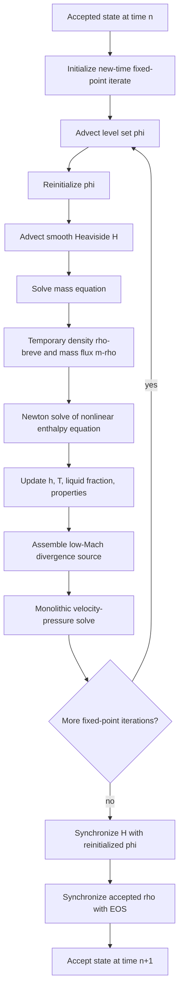

# Complete Solution Algorithm for the Low-Mach Enthalpy Method

## Gas–liquid–solid flow with melting, solidification, density change, and a free surface

**Primary source:** R. Thirumalaisamy and A. P. S. Bhalla, *A low Mach enthalpy method to model non-isothermal gas–liquid–solid flows with melting and solidification*, International Journal of Multiphase Flow 169 (2023) 104605.

This document reconstructs the complete numerical solution procedure described in Sections 4.1–4.2 and Appendix B of the paper. It expands the paper's concise algorithm into implementation-level steps while preserving the paper's variable definitions, time levels, nonlinear iteration structure, transport consistency requirements, solver tolerances, and spatial arrangement.

Two labels are used throughout:

- **Paper specification** means the item is stated explicitly in the paper.
- **Implementation expansion** means the item follows directly from the stated equations or from a standard realization of a named method, but the paper does not print every low-level line of the implementation.

The paper refers to earlier work for four components whose exact formulas are not reproduced: the complete cubic-upwind-interpolation stencil, the level-set reinitialization routine, the mollified Heaviside used in the surface-tension force, and the projection-method preconditioner for the coupled velocity–pressure solve. These boundaries are identified explicitly rather than filled in silently.

---

## 1. Purpose of the algorithm

The method advances a three-region system on a fixed Eulerian grid:

1. a passive gas region, denoted \(\Omega^G\);
2. a liquid phase-change-material region, denoted \(\Omega^L\);
3. a solid phase-change-material region, denoted \(\Omega^S\).

The gas–PCM interface is tracked using a level-set field. The liquid–solid transition is represented diffusely using an enthalpy method and a liquid-fraction field. Solid and liquid densities may differ, so melting or solidification changes material volume. The velocity is therefore not generally divergence-free inside the mushy region. It remains divergence-free in the bulk gas, bulk solid, and bulk liquid.

The algorithm is designed around four consistency requirements:

1. **Equation-of-state consistency:** accepted density must remain a function of the gas indicator and liquid fraction.
2. **Low-Mach kinematic consistency:** the velocity divergence must reproduce the density change generated by phase change.
3. **High-density-ratio transport consistency:** the same discrete mass flux must advect mass, enthalpy, and momentum.
4. **Phase-state consistency:** enthalpy, temperature, liquid fraction, density, and material properties must be synchronized after each nonlinear update.

---

## 2. Unknown fields and derived fields

### 2.1 Primary fields

| Symbol | Meaning | Typical grid location in the paper |
|---|---|---|
| \(\mathbf u(\mathbf x,t)\) | Eulerian velocity | staggered cell faces |
| \(p(\mathbf x,t)\) | mechanical pressure; Lagrange multiplier for the low-Mach constraint | cell centers |
| \(h(\mathbf x,t)\) | specific enthalpy | cell centers |
| \(T(\mathbf x,t)\) | temperature | cell centers |
| \(\phi(\mathbf x,t)\) | signed-distance level-set field for the gas–PCM interface | cell centers |
| \(H(\mathbf x,t)\) | smooth Heaviside gas/PCM indicator | cell centers |
| \(\varphi(\mathbf x,t)\) | liquid fraction inside the PCM | cell centers |
| \(\rho(\mathbf x,t)\) | EOS density | cell centers |

The paper uses two visually similar phase variables:

- \(\phi\): level-set function; positive in the PCM and negative in the gas;
- \(\varphi\): liquid fraction; \(0\) in solid, \(1\) in liquid, and between \(0\) and \(1\) in the mushy zone.

These must never be interchanged in an implementation.

### 2.2 Derived or temporary fields

| Symbol | Meaning |
|---|---|
| \(\breve\rho^{n+1,k+1}\) | temporary density obtained by solving the discrete mass equation during a time step |
| \(\mathbf m_\rho\) | discrete mass flux, nominally \(\rho\mathbf u\), reused in all convective operators |
| \(\kappa\) | thermal conductivity blended from gas, solid, and liquid values |
| \(\mu\) | dynamic viscosity blended from gas, solid, and liquid values |
| \(C\) | specific heat blended from gas, solid, and liquid values; not needed directly in the conservative enthalpy equation but retained for consistency/post-processing |
| \(\varphi_S\) | solid fraction used by the Carman–Kozeny penalization |
| \(A_d\) | Carman–Kozeny drag coefficient |
| \(\mathcal C\) | curvature of the gas–PCM interface computed from \(\phi\) |
| \(\widetilde B(\phi)\) | mollified Heaviside used to localize surface tension |
| \(S_{\nabla\cdot u}\) | right-hand side of the low-Mach divergence constraint |

---

## 3. Phase indicators and constitutive closure

### 3.1 Level-set convention

The level-set field satisfies

$$
\phi>0 \quad \text{in the PCM},
\qquad
\phi<0 \quad \text{in the gas},
\qquad
\phi=0 \quad \text{on the gas–PCM interface}.
$$

The material advection equation is

$$
\frac{D\phi}{Dt}
=
\frac{\partial\phi}{\partial t}
+
\mathbf u\cdot\nabla\phi
=0.
$$

Because the velocity can have nonzero divergence, the discrete implementation uses an equivalent conservative-plus-source form rather than treating \(\nabla\cdot(\phi\mathbf u)\) as if \(\nabla\cdot\mathbf u=0\).

### 3.2 Smooth Heaviside function

The paper uses a transition width of \(n_{\text{cells}}=2\) grid cells on either side of the gas–PCM interface. For a representative grid spacing \(\Delta\),

$$
H(\phi)=
\begin{cases}
0,
& \phi<-n_{\text{cells}}\Delta,\\[4pt]
\dfrac12\left[
1+
\dfrac{\phi}{n_{\text{cells}}\Delta}
+
\dfrac1\pi
\sin\left(\dfrac{\pi\phi}{n_{\text{cells}}\Delta}\right)
\right],
& |\phi|\le n_{\text{cells}}\Delta,\\[10pt]
1,
& \phi>n_{\text{cells}}\Delta.
\end{cases}
$$

Thus,

- \(H=0\) in the gas;
- \(H=1\) in the PCM;
- \(0<H<1\) only in the regularized gas–PCM transition band.

### 3.3 Three-phase blending rule

For any material property \(\beta\), such as \(\rho\), \(\kappa\), \(C\), or \(\mu\),

$$
\beta
=
\beta^G
+
(\beta^S-\beta^G)H
+
(\beta^L-\beta^S)H\varphi.
$$

This gives the correct limits:

- gas: \(H=0\Rightarrow\beta=\beta^G\);
- solid PCM: \(H=1,\varphi=0\Rightarrow\beta=\beta^S\);
- liquid PCM: \(H=1,\varphi=1\Rightarrow\beta=\beta^L\).

The equation of state is therefore

$$
\rho
=
\rho^G
+
(\rho^S-\rho^G)H
+
(\rho^L-\rho^S)H\varphi.
\tag{EOS}
$$

This EOS defines the accepted density field. The separately advected density \(\breve\rho\) is temporary and is synchronized back to this EOS after the time step.

### 3.4 PCM enthalpy–temperature relation

Define

$$
\overline C=\frac{C^S+C^L}{2},
$$

$$
h^{\mathrm{sol}}=C^S\left(T^{\mathrm{sol}}-T_r\right),
$$

and

$$
h^{\mathrm{liq}}
=
\overline C\left(T^{\mathrm{liq}}-T^{\mathrm{sol}}\right)
+h^{\mathrm{sol}}
+L.
$$

The PCM specific enthalpy is

$$
h(T,\varphi)=
\begin{cases}
C^S(T-T_r),
& T<T^{\mathrm{sol}},\\[4pt]
\overline C\left(T-T^{\mathrm{sol}}\right)
+h^{\mathrm{sol}}
+\varphi\dfrac{\rho^L}{\rho}L,
& T^{\mathrm{sol}}\le T\le T^{\mathrm{liq}},\\[8pt]
C^L\left(T-T^{\mathrm{liq}}\right)+h^{\mathrm{liq}},
& T>T^{\mathrm{liq}}.
\end{cases}
$$

The gas enthalpy is

$$
h^G(T)=C^G(T-T_r).
$$

The paper usually sets the reference temperature to the phase-change temperature,

$$
T_r=T_m,
$$

although the numerical formulation is not dependent on this particular reference choice.

### 3.5 Mushy-region mixture relations

Inside the PCM, where \(H=1\),

$$
\rho=\varphi\rho^L+(1-\varphi)\rho^S,
$$

and

$$
\rho h
=
\varphi\rho^L h^{\mathrm{liq}}
+
(1-\varphi)\rho^S h^{\mathrm{sol}}.
$$

Combining these relations gives the mushy-region liquid fraction as a function of temperature:

$$
\varphi
=
\frac{\rho}{\rho^L}
\frac{T-T^{\mathrm{sol}}}
{T^{\mathrm{liq}}-T^{\mathrm{sol}}}.
$$

### 3.6 Exact inversion from enthalpy to temperature

Within the PCM,

$$
T(h)=
\begin{cases}
\dfrac{h}{C^S}+T_r,
& h<h^{\mathrm{sol}},\\[8pt]
T^{\mathrm{sol}}
+
\dfrac{h-h^{\mathrm{sol}}}
{h^{\mathrm{liq}}-h^{\mathrm{sol}}}
\left(T^{\mathrm{liq}}-T^{\mathrm{sol}}\right),
& h^{\mathrm{sol}}\le h\le h^{\mathrm{liq}},\\[10pt]
T^{\mathrm{liq}}
+
\dfrac{h-h^{\mathrm{liq}}}{C^L},
& h>h^{\mathrm{liq}}.
\end{cases}
$$

In the gas,

$$
T(h)=\frac{h}{C^G}+T_r.
$$

### 3.7 Exact liquid-fraction map from enthalpy

The PCM liquid fraction is

$$
\varphi(h)=
\begin{cases}
0,
& h<h^{\mathrm{sol}},\\[4pt]
\dfrac{
\rho^S\left(h^{\mathrm{sol}}-h\right)
}{
h(\rho^L-\rho^S)
-\rho^L h^{\mathrm{liq}}
+\rho^S h^{\mathrm{sol}}
},
& h^{\mathrm{sol}}\le h\le h^{\mathrm{liq}},\\[12pt]
1,
& h>h^{\mathrm{liq}}.
\end{cases}
$$

The paper defines \(\varphi=0\) in the gas. This value is arbitrary there because \(H=0\) removes the PCM contribution from the property blends.

In code, the phase branch should be selected using the gas/PCM indicator first and then the enthalpy range. A robust ordering is:

1. if \(H<0.5\), treat the cell as gas and set \(\varphi=0\);
2. otherwise evaluate the PCM branches above.

### 3.8 Enthalpy derivative used by Newton's method

The derivative used in the Newton linearization is

$$
\left.\frac{\partial h}{\partial T}\right|_{\mathrm{PCM}}
=
\begin{cases}
C^S,
& T<T^{\mathrm{sol}},\\[4pt]
\overline C+
\dfrac{L}{T^{\mathrm{liq}}-T^{\mathrm{sol}}},
& T^{\mathrm{sol}}\le T\le T^{\mathrm{liq}},\\[10pt]
C^L,
& T>T^{\mathrm{liq}}.
\end{cases}
$$

In the gas,

$$
\left.\frac{\partial h}{\partial T}\right|_G=C^G.
$$

The paper uses the sharp logical switch

$$
\frac{\partial h}{\partial T}
=
\begin{cases}
\left.\dfrac{\partial h}{\partial T}\right|_{\mathrm{PCM}},
& H\ge 0.5,\\[8pt]
C^G,
& H<0.5.
\end{cases}
$$

It notes that a smooth blend,

$$
H\left.\frac{\partial h}{\partial T}\right|_{\mathrm{PCM}}
+
(1-H)C^G,
$$

was tested but did not materially improve Newton convergence, so the discontinuous \(H=0.5\) switch was retained.

### 3.9 Material derivative of liquid fraction

In the mushy region,

$$
\frac{D\varphi}{Dt}
=
-
\frac{
\rho^S\rho^L
\left(h^{\mathrm{sol}}-h^{\mathrm{liq}}\right)
}{
\left[
h(\rho^L-\rho^S)
-\rho^L h^{\mathrm{liq}}
+\rho^S h^{\mathrm{sol}}
\right]^2
}
\frac{Dh}{Dt}.
$$

Outside the mushy interval, \(D\varphi/Dt=0\). The enthalpy equation gives

$$
\frac{Dh}{Dt}
=
\frac{1}{\rho}
\left[
\nabla\cdot(\kappa\nabla T)+Q_{\mathrm{src}}
\right].
$$

The examples in the paper use \(Q_{\mathrm{src}}=0\).

---

## 4. Governing equations used by the algorithm

### 4.1 Conservative mass equation

$$
\frac{\partial\rho}{\partial t}
+
\nabla\cdot(\rho\mathbf u)
=0.
$$

### 4.2 Conservative enthalpy equation

$$
\frac{\partial(\rho h)}{\partial t}
+
\nabla\cdot(\rho\mathbf u h)
=
\nabla\cdot(\kappa\nabla T)
+Q_{\mathrm{src}}.
$$

### 4.3 Momentum equation

The continuous model is

$$
\frac{\partial(\rho\mathbf u)}{\partial t}
+
\nabla\cdot(\rho\mathbf u\otimes\mathbf u)
=
-\nabla p
+
\nabla\cdot\left[
\mu(\nabla\mathbf u+\nabla\mathbf u^T)
\right]
+
\rho\mathbf g
-
A_d\mathbf u
+
\mathbf f_{\mathrm{st}}.
$$

Pressure is mechanical, not thermodynamic. It acts as a Lagrange multiplier enforcing the nonzero-divergence low-Mach constraint.

### 4.4 Low-Mach velocity-divergence constraint

Combining mass conservation with the EOS gives

$$
\nabla\cdot\mathbf u
=-\frac{1}{\rho}\frac{D\rho}{Dt}.
$$

Since \(DH/Dt=0\) for a passively advected gas–PCM interface,

$$
\nabla\cdot\mathbf u
=
\frac{\rho^S-\rho^L}{\rho}
H
\frac{D\varphi}{Dt}.
$$

Consequently:

- gas: \(H=0\Rightarrow\nabla\cdot\mathbf u=0\);
- fully solid PCM: \(D\varphi/Dt=0\Rightarrow\nabla\cdot\mathbf u=0\);
- fully liquid PCM: \(D\varphi/Dt=0\Rightarrow\nabla\cdot\mathbf u=0\);
- mushy PCM with \(\rho^S\ne\rho^L\): generally \(\nabla\cdot\mathbf u\ne0\).

The discrete branch form used in the momentum solve is given later in Section 11.

### 4.5 Solid penalization

Define the solid fraction

$$
\varphi_S=H(1-\varphi).
$$

The Carman–Kozeny coefficient is

$$
A_d
=
C_d
\frac{\varphi_S^2}
{(1-\varphi_S)^3+\epsilon},
$$

with

$$
\epsilon=10^{-3}.
$$

The paper selects a sufficiently large penalization scale by balancing inertial and drag terms:

$$
C_d=\frac{\rho^S}{\Delta t}.
$$

Thus, as \(\varphi_S\to1\), the drag strongly suppresses velocity inside the solid.

### 4.6 Surface tension

The continuous surface-tension force acting at the liquid–gas interface is

$$
\mathbf f_{\mathrm{st}}
=
\varphi
\frac{2\breve\rho}{\rho^L+\rho^G}
\left(
\sigma\mathcal C\nabla\widetilde B
\right).
$$

The liquid-fraction factor suppresses surface tension at a gas–solid interface. Curvature is

$$
\mathcal C(\phi)
=-\nabla\cdot
\left(
\frac{\nabla\phi}{\|\nabla\phi\|}
\right).
$$

The paper computes curvature and \(\widetilde B\) from the midpoint level set

$$
\phi^{n+\frac12,k+1}
=
\frac12
\left(
\phi^{n+1,k+1}+\phi^n
\right).
$$

The precise formula for \(\widetilde B\) is not printed in the paper; it is only identified as a mollified Heaviside localized near the PCM–gas interface.

---

## 5. Discrete grid arrangement

The paper uses a staggered Cartesian grid.

### 5.1 Cell-centered quantities

The following are stored at cell centers:

- pressure \(p\);
- specific enthalpy \(h\);
- temperature \(T\);
- density \(\rho\) and temporary density \(\breve\rho\);
- level-set field \(\phi\);
- smooth Heaviside field \(H\);
- liquid fraction \(\varphi\);
- material properties \(\kappa\), \(\mu\), and \(C\).

### 5.2 Face-centered quantities

Velocity components are stored on their normal faces. In two dimensions,

- \(u\) is stored on faces normal to the \(x\)-direction;
- \(v\) is stored on faces normal to the \(y\)-direction.

Momentum sources, including pressure gradient, surface tension, gravity if retained, and Carman–Kozeny drag, are assembled at velocity locations.

### 5.3 Interpolation

- Cell-centered quantities needed at faces use second-order interpolation.
- Thermal conductivity is harmonically averaged to faces.
- Viscosity values needed at grid nodes/corners are harmonically averaged from neighboring cell-centered values.

The complete finite-difference formulas are listed in Section 14.

---

## 6. Time and iteration notation

Let

$$
\Delta t=t^{n+1}-t^n.
$$

The algorithm contains two nested nonlinear iteration levels.

### 6.1 Fixed-point iteration

The outer iteration index is

$$
k=0,1,\ldots,p-1.
$$

The accepted end-of-step state is approximated as

$$
\theta^{n+1}\approx\theta^{n+1,p-1}.
$$

The paper uses

$$
p=2
$$

for all reported cases unless otherwise stated. It does not define a residual-based stopping test for the fixed-point loop; it uses a prescribed count.

### 6.2 Newton iteration for enthalpy

Within every fixed-point iteration,

$$
m=0,1,\ldots,q_{\max}-1.
$$

The paper uses

$$
q_{\max}=5.
$$

The Newton convergence criterion is based on the relative change in liquid fraction and is given in Section 10.7.

### 6.3 Start-of-step initialization

For the variables explicitly listed in the paper,

$$
\theta^{n+1,k=0}=\theta^n,
\qquad
\theta\in\{\mathbf u,\rho,\phi,H\}.
$$

The initial temperature iterate is

$$
T^{n+1,k=0,m=0}=T^n.
$$

**Implementation expansion:** initialize \(h\), \(\varphi\), \(\kappa\), \(\mu\), and \(C\) consistently from the accepted state at \(t^n\). The paper explicitly initializes temperature and then uses analytical constitutive maps to recover the other thermodynamic quantities.

---

## 7. High-level dependency graph



The order is essential: the mass solve supplies the mass flux used by both the enthalpy and momentum equations, and the enthalpy solve supplies the liquid fraction and divergence source used by the momentum–pressure solve.


---

## 8. Complete time-step algorithm

Assume all accepted fields at \(t^n\) are mutually consistent:

$$
H^n=H(\phi^n),
$$

$$
\rho^n
=
\rho^G+(\rho^S-\rho^G)H^n
+(\rho^L-\rho^S)H^n\varphi^n,
$$

and \(h^n\), \(T^n\), and \(\varphi^n\) satisfy the constitutive maps in Section 3.

The complete advance from \(t^n\) to \(t^{n+1}\) is as follows.

### 8.1 Select the time step

**Paper specification:** all reported simulations use a uniform \(\Delta t\), and the CFL number is kept at or below \(0.5\).

A representative convective restriction is

$$
\mathrm{CFL}
=
\max_{\text{cells}}
\left(
\frac{|u|\Delta t}{\Delta x}
+
\frac{|v|\Delta t}{\Delta y}
+
\frac{|w|\Delta t}{\Delta z}
\right)
\le0.5.
$$

The paper does not prescribe an adaptive time-step controller. If adaptive stepping is introduced, the drag scale \(C_d=\rho^S/\Delta t\), all time coefficients, and any explicit transport stability limits must be updated whenever \(\Delta t\) changes.

### 8.2 Initialize the new-time iterate

Set

$$
\mathbf u^{n+1,0}=\mathbf u^n,
\qquad
\rho^{n+1,0}=\rho^n,
\qquad
\phi^{n+1,0}=\phi^n,
\qquad
H^{n+1,0}=H^n.
$$

For the first enthalpy Newton solve,

$$
T^{n+1,0,0}=T^n.
$$

**Implementation expansion:** also carry forward \(h^n\), \(\varphi^n\), \(\kappa^n\), \(\mu^n\), and \(C^n\) as initial guesses. For later fixed-point iterations, use the preceding fixed-point solution as the Newton initial guess:

$$
T^{n+1,k+1,0}\leftarrow T^{n+1,k}.
$$

This warm start is the natural interpretation of the nested fixed-point/Newton structure, although the paper does not print this assignment explicitly.

### 8.3 Enter the fixed-point loop

For

$$
k=0,1,\ldots,p-1,
\qquad p=2,
$$

perform Steps 8.4 through 8.10.

A key point is that each fixed-point sweep recomputes a full \(n\to n+1\) update. The time-difference terms always use the accepted old-time state \(n\); they do not advance incrementally from fixed-point iterate \(k\) to \(k+1\).

---

## 9. Step 1 — Advect and reinitialize the level set

### 9.1 Discrete level-set advection equation

Solve

$$
\frac{
\phi^{n+1,k+1}-\phi^n
}{\Delta t}
+
\left(
\nabla\cdot[\phi\mathbf u]
\right)^{n+1,k}
=
\left(
\phi\nabla\cdot\mathbf u
\right)^{n+1,k}.
\tag{LS}
$$

The left convective term and the right divergence correction combine to give

$$
\nabla\cdot(\phi\mathbf u)-\phi\nabla\cdot\mathbf u
=\mathbf u\cdot\nabla\phi,
$$

so the equation remains equivalent to

$$
\partial_t\phi+\mathbf u\cdot\nabla\phi=0
$$

when \(\nabla\cdot\mathbf u\ne0\).

### 9.2 Velocity used for advection

Use the current fixed-point velocity,

$$
\mathbf u^{n+1,k}.
$$

At \(k=0\), this is the old accepted velocity \(\mathbf u^n\). At \(k=1\), it is the velocity produced by the preceding coupled momentum–pressure solve.

### 9.3 Spatial convection scheme

**Paper specification:** use third-order cubic upwind interpolation (CUI). The stated properties are:

- third-order accuracy in monotone regions;
- convection-boundedness-criterion compliance;
- total-variation-diminishing behavior;
- reduction toward first-order upwinding near non-monotone regions.

The complete CUI normalized-variable stencil is not printed in this paper; it is referred to prior work. A faithful implementation must use the same bounded face reconstruction for \(\phi\), \(H\), \(\rho\), and any other explicitly advected scalar for which the paper specifies CUI.

### 9.4 Level-set boundary conditions

The paper's solution algorithm does not prescribe universal level-set boundary conditions because they depend on the physical problem. The implementation must provide inflow values where \(\mathbf u\cdot\mathbf n<0\), and consistent outflow, wall, periodic, or symmetry treatment elsewhere.

### 9.5 Reinitialize the level set

After advection, restore the signed-distance property

$$
\|\nabla\phi\|\approx1
$$

without moving the \(\phi=0\) interface.

**Paper specification:** use the Sussman–Smereka–Osher reinitialization procedure described in the authors' earlier work.

**Implementation expansion:** the canonical Sussman pseudo-time equation is

$$
\frac{\partial\phi}{\partial\tau}
+
S_\epsilon(\phi_0)
\left(
\|\nabla\phi\|-1
\right)
=0,
\qquad
\phi(\tau=0)=\phi_0,
$$

where \(\phi_0\) is the just-advected field and \(S_\epsilon\) is a regularized sign function. The paper does not specify the pseudo-time step, number of pseudo-time sweeps, spatial Hamiltonian, or interface-locking details in this article. Those choices must be taken from the referenced implementation rather than guessed when exact reproduction is required.

The output of this substep is the reinitialized

$$
\phi^{n+1,k+1}.
$$

---

## 10. Step 2 — Advect the smooth Heaviside field

### 10.1 Construct the old-time Heaviside

At the start of the physical time step, define

$$
H^n=H(\phi^n)
$$

using the smooth formula in Section 3.2.

### 10.2 Discrete Heaviside advection equation

Solve

$$
\frac{
H^{n+1,k+1}-H^n
}{\Delta t}
+
\left(
\nabla\cdot[H\mathbf u]
\right)^{n+1,k}
=
\left(
H\nabla\cdot\mathbf u
\right)^{n+1,k}.
\tag{H}
$$

As for the level set, the source term converts the conservative transport operator into the material-advection equation

$$
\partial_tH+\mathbf u\cdot\nabla H=0
$$

for a non-divergence-free velocity.

### 10.3 Why advect \(H\) instead of only recomputing it from \(\phi\)

The paper deliberately advects \(H\), even though \(H^{n+1,k+1}\) could be reconstructed directly from \(\phi^{n+1,k+1}\). The reason is to obtain the discrete advective flux \(H\mathbf u\), which can be reused to transport other phase-confined scalar variables in more elaborate models.

### 10.4 Bounded advection

Use the same CUI procedure as in the level-set equation. The boundedness target is

$$
0\le H\le1.
$$

Small floating-point excursions should not be allowed to contaminate the EOS or property blends. Clipping may be used as a defensive operation, but clipping is not identified as part of the paper's formal algorithm; the preferred control is the bounded CUI transport itself.

### 10.5 Do not perform final synchronization yet

Within the fixed-point loop, retain the advected field

$$
H^{n+1,k+1}.
$$

The final synchronization

$$
H^{n+1}\leftarrow H(\phi^{n+1})
$$

is carried out only after the fixed-point sweeps are complete.

---

## 11. Step 3 — Solve the conservative mass equation and construct the common mass flux

### 11.1 Discrete equation

Solve

$$
\frac{
\breve\rho^{n+1,k+1}-\rho^n
}{\Delta t}
+
\left(
\nabla\cdot\mathbf m_\rho
\right)^{n+1,k}
=0.
\tag{M}
$$

The output is

1. the temporary end-of-step density \(\breve\rho^{n+1,k+1}\);
2. the discrete mass flux \(\mathbf m_\rho\) used in all subsequent convection terms during this fixed-point sweep.

### 11.2 Old density must come from the EOS

Before solving the mass equation, ensure

$$
\rho^n
=
\rho^G+(\rho^S-\rho^G)H^n
+(\rho^L-\rho^S)H^n\varphi^n.
$$

The mass update does not begin from a density left over from an unconstrained previous transport solve.

### 11.3 Runge–Kutta time integration

**Paper specification:** integrate the mass equation with a second-order explicit Runge–Kutta midpoint rule.

The paper does not print the stage equations. A standard midpoint realization of the stated method is as follows. Define a semi-discrete mass-transport operator

$$
\mathcal L_\rho(\rho;\mathbf u)
=-\mathbf D\cdot\mathbf F_\rho(\rho,\mathbf u),
$$

where \(\mathbf F_\rho\) is the CUI-limited face mass flux. Then

1. predictor to the midpoint:

$$
\rho^{(1)}
=
\rho^n
+
\frac{\Delta t}{2}
\mathcal L_\rho
\left(\rho^n;\mathbf u^{n+1,k}\right);
$$

2. reconstruct a bounded midpoint face density and midpoint mass flux:

$$
\mathbf m_{\rho,f}^{(1)}
=
\rho_f^{(1)}\mathbf u_f^{n+1,k};
$$

3. correct to the new time:

$$
\breve\rho^{n+1,k+1}
=
\rho^n
+
\Delta t
\mathcal L_\rho
\left(\rho^{(1)};\mathbf u^{n+1,k}\right).
$$

The exact stage naming and which RK flux is retained as \(\mathbf m_\rho^{n+1,k}\) are implementation details not printed in the paper. What is non-negotiable is that the mass flux returned by the mass update is the same numerical flux used in the enthalpy and momentum convective operators.

### 11.4 Density limiting

Use CUI as a limiter so the transported density remains bounded. For a three-phase mixture, an implementation should at minimum preserve positivity and avoid overshoots beyond the phase-density envelope caused purely by interpolation.

### 11.5 Temporary nature of \(\breve\rho\)

The mass equation's new density is denoted with a decoration because it is not the final accepted thermodynamic density. It is used inside the time step to provide a conservative inertial coefficient and to construct a flux-consistent update. After the full time step,

$$
\breve\rho^{n+1}
\quad\text{is replaced by}\quad
\rho^{n+1}=\rho(H^{n+1},\varphi^{n+1})
$$

from the EOS.

This synchronization has two purposes stated in the paper:

1. prevent drift away from the EOS;
2. restore a sharp gas–PCM density transition tied to the reinitialized level set.

### 11.6 Common-flux invariant

The following three operators must use the identical face mass flux, including the same face value, limiter, sign convention, and boundary contribution:

$$
\nabla\cdot\mathbf m_\rho,
$$

$$
\nabla\cdot(\mathbf m_\rho h),
$$

$$
\nabla\cdot(\mathbf m_\rho\otimes\mathbf u).
$$

Recomputing \(\rho\mathbf u\) independently in the energy or momentum assembly breaks the high-density-ratio consistency on which the method relies.

---

## 12. Step 4 — Solve the nonlinear enthalpy equation

### 12.1 Discrete conservative enthalpy equation

Using the temporary density and common mass flux from the mass solve, solve

$$
\frac{
\breve\rho^{n+1,k+1}h^{n+1,k+1}
-
\rho^n h^n
}{\Delta t}
+
\left[
\nabla\cdot(\mathbf m_\rho h)
\right]^{n+1,k}
=
\left[
\nabla\cdot(\kappa\nabla T)
\right]^{n+1,k+1}
+Q_{\mathrm{src}}.
\tag{E}
$$

For the examples in the paper,

$$
Q_{\mathrm{src}}=0.
$$

The source may be treated explicitly or implicitly in a more general problem, depending on stiffness and complexity. No universal source linearization is prescribed.

### 12.2 Quantities held fixed during the inner Newton loop

Within a given fixed-point sweep \(k\):

- \(\breve\rho^{n+1,k+1}\) is fixed;
- \(\mathbf m_\rho^{n+1,k}\) is fixed;
- the old-time conservative state \(\rho^n h^n\) is fixed;
- the fixed-point-level convective term is fixed or evaluated from the current outer iterate, as indicated by the absence of an \(m\) index in the paper;
- the thermodynamic relation \(h(T)\), liquid fraction, conductivity, and other properties are iterated.

### 12.3 Newton initialization

For \(m=0\), use the current best temperature estimate. At the first fixed-point sweep this is \(T^n\); at later sweeps, use the preceding outer solution as a warm start.

From that temperature, construct a thermodynamically consistent initial state:

1. determine gas versus PCM using \(H^{n+1,k+1}\);
2. evaluate \(h^{m}\), or carry the consistent current enthalpy;
3. evaluate \(\varphi^{m}\);
4. update \(\rho^{m}\), \(\kappa^{m}\), \(\mu^{m}\), and \(C^{m}\) from the constitutive laws.

### 12.4 Newton linearization of enthalpy

At iteration \(m\), linearize enthalpy about the current temperature:

$$
h^{n+1,k+1,m+1}
=
h^{n+1,k+1,m}
+
\left.
\frac{\partial h}{\partial T}
\right|^{n+1,k+1,m}
\left(
T^{n+1,k+1,m+1}
-
T^{n+1,k+1,m}
\right).
\tag{N1}
$$

The derivative is the piecewise function in Section 3.8.

### 12.5 Linear temperature equation

Substitute the Newton expansion into the conservative enthalpy equation:

$$
\begin{aligned}
&\frac{\breve\rho^{n+1,k+1}}{\Delta t}
\Bigg[
 h^{m}
+
 h_T^{m}
 \left(T^{m+1}-T^{m}\right)
\Bigg]
-
\frac{\rho^nh^n}{\Delta t}
\\
&\qquad+
\left[
\nabla\cdot(\mathbf m_\rho h)
\right]^{n+1,k}
=
\nabla\cdot
\left(
\kappa\nabla T^{m+1}
\right)
+Q_{\mathrm{src}},
\end{aligned}
\tag{N2}
$$

where compact notation has been used:

$$
h^m=h^{n+1,k+1,m},
\qquad
h_T^m=
\left.\frac{\partial h}{\partial T}\right|^{n+1,k+1,m}.
$$

An explicit matrix form is

$$
\left[
\frac{\breve\rho h_T^m}{\Delta t}\mathbf I
-
\mathbf D\cdot\kappa^m\mathbf G
\right]
T^{m+1}
=
\mathbf r_T^m,
$$

with

$$
\begin{aligned}
\mathbf r_T^m
={}&
\frac{\rho^nh^n}{\Delta t}
-
\left[
\mathbf D\cdot(\mathbf m_\rho h)
\right]^{n+1,k}
+Q_{\mathrm{src}}
\\
&-
\frac{\breve\rho}{\Delta t}
\left(
 h^m-h_T^mT^m
\right).
\end{aligned}
$$

**Important interpretation:** the paper writes the diffusion operator at the new Newton level but only provides an explicit Newton derivative for \(h(T)\). It then updates \(\kappa\) after each thermodynamic update. Therefore, the direct implementation is a Picard/Newton hybrid: use the conductivity from the current iterate to assemble a linear diffusion operator for \(T^{m+1}\), then refresh \(\kappa\). The paper does not include a \(d\kappa/dT\) Jacobian contribution.

### 12.6 Solve the linear temperature system

**Paper specification:** use

- FGMRES;
- a geometric multigrid preconditioner;
- relative linear tolerance \(10^{-9}\).

The paper does not state an absolute tolerance, maximum Krylov iteration count, norm scaling, or multigrid cycle details. These are solver-configuration choices outside the printed algorithm.

### 12.7 Update enthalpy

After obtaining \(T^{m+1}\), update enthalpy using the Newton formula:

$$
h^{m+1}
\leftarrow
h^m+h_T^m(T^{m+1}-T^m).
$$

### 12.8 Restore exact constitutive consistency

Using the updated enthalpy:

1. recompute temperature from the exact inverse \(T(h)\);
2. recompute liquid fraction from the exact map \(\varphi(h)\);
3. set \(\varphi=0\) in gas cells;
4. enforce the physical branches \(0\le\varphi\le1\).

This step is important because the linearized enthalpy update is only a local approximation; the analytical inverse puts the state back on the intended piecewise constitutive curve.

### 12.9 Update properties

Using \(H^{n+1,k+1}\) and \(\varphi^{m+1}\), update

$$
\kappa^{m+1},
\qquad
\mu^{m+1},
\qquad
C^{m+1},
\qquad
\rho_{\mathrm{EOS}}^{m+1}
$$

with the three-phase blend. The paper explicitly mentions updating \(\kappa\), \(C\), and \(\mu\). Density is required by the EOS and the low-Mach source and must likewise be evaluated consistently from the newest phase state.

The temporary conservative density \(\breve\rho\) used in the enthalpy transient term is not replaced inside this solve; the EOS density is used where the constitutive and low-Mach formulas require \(\rho\).

### 12.10 Newton convergence measure

Compute

$$
\epsilon_\varphi
=
\frac{
\left\|
\varphi^{n+1,k+1,m+1}
-
\varphi^{n+1,k+1,m}
\right\|_2
}{
1+
\left\|
\varphi^{n+1,k+1,m}
\right\|_2
}.
$$

Declare the enthalpy solve complete when either

$$
\epsilon_\varphi\le10^{-8}
$$

or

$$
m+1=q_{\max}=5.
$$

The paper treats reaching the iteration cap as completion; it does not describe time-step rejection or nonlinear failure recovery. A production code should report whether termination occurred by tolerance or by iteration limit.

### 12.11 Accepted thermodynamic state for this fixed-point sweep

After Newton termination, define

$$
h^{n+1,k+1}=h^{n+1,k+1,m_{\mathrm{final}}},
$$

$$
T^{n+1,k+1}=T^{n+1,k+1,m_{\mathrm{final}}},
$$

$$
\varphi^{n+1,k+1}=\varphi^{n+1,k+1,m_{\mathrm{final}}},
$$

and retain the corresponding material properties for the flow solve.

---

## 13. Step 5 — Assemble the low-Mach divergence source

### 13.1 Branch structure

Using the most recently updated

$$
H^{n+1,k+1},
\quad
h^{n+1,k+1},
\quad
T^{n+1,k+1},
\quad
\rho^{n+1,k+1}_{\mathrm{EOS}},
\quad
\kappa^{n+1,k+1},
$$

construct

$$
\nabla\cdot\mathbf u=S_{\nabla\cdot u}
$$

with

$$
S_{\nabla\cdot u}
=
\begin{cases}
0,
& H<0.5,\\[4pt]
0,
& H\ge0.5\ \text{and}\ h<h^{\mathrm{sol}},\\[6pt]
S_{\mathrm{mushy}},
& H\ge0.5\ \text{and}\
 h^{\mathrm{sol}}\le h\le h^{\mathrm{liq}},\\[6pt]
0,
& H\ge0.5\ \text{and}\ h>h^{\mathrm{liq}}.
\end{cases}
$$

The mushy-region value printed in the paper is

$$
\begin{aligned}
S_{\mathrm{mushy}}
={}&-
\frac{\rho^S\rho^L}{\rho^2}
(\rho^L-\rho^S)H
\\
&\times
\frac{h^{\mathrm{liq}}-h^{\mathrm{sol}}}
{\left[
 h(\rho^L-\rho^S)
 -\rho^Lh^{\mathrm{liq}}
 +\rho^Sh^{\mathrm{sol}}
\right]^2}
\\
&\times
\nabla\cdot(\kappa\nabla T).
\end{aligned}
\tag{DIV}
$$

### 13.2 Heat source extension

The general continuous derivation uses

$$
\frac{Dh}{Dt}
=\frac1\rho
\left[
\nabla\cdot(\kappa\nabla T)+Q_{\mathrm{src}}
\right].
$$

Equation (DIV) in the paper contains only the diffusion term because the reported examples use \(Q_{\mathrm{src}}=0\). If a volumetric heat source is present, the mathematically consistent divergence source contains the same \(Q_{\mathrm{src}}\) contribution.

### 13.3 Discrete consistency of the diffusion term

**Implementation expansion:** use the same discrete conductivity, face averaging, boundary fluxes, and diffusion operator as in the enthalpy equation. Computing \(\nabla\cdot(\kappa\nabla T)\) with a different stencil creates a mismatch between phase-change energy and phase-change volume generation.

### 13.4 Limiting cases that should hold exactly

The assembled source should satisfy:

1. \(H=0\Rightarrow S_{\nabla\cdot u}=0\);
2. \(\rho^L=\rho^S\Rightarrow S_{\nabla\cdot u}=0\);
3. \(h<h^{\mathrm{sol}}\Rightarrow S_{\nabla\cdot u}=0\);
4. \(h>h^{\mathrm{liq}}\Rightarrow S_{\nabla\cdot u}=0\);
5. no conductive/source heating in the mushy region \(\Rightarrow S_{\nabla\cdot u}=0\).

These are strong unit-test targets.

---

## 14. Step 6 — Solve momentum and the low-Mach constraint monolithically

### 14.1 Printed discrete momentum equation

Solve

$$
\begin{aligned}
&\frac{
\breve\rho^{n+1,k+1}\mathbf u^{n+1,k+1}
-
\rho^n\mathbf u^n
}{\Delta t}
+
\left[
\nabla\cdot(\mathbf m_\rho\otimes\mathbf u)
\right]^{n+1,k}
\\
&\qquad=
-\nabla p^{n+\frac12,k+1}
+
\left\{
\nabla\cdot
\left[
\mu(\nabla\mathbf u+\nabla\mathbf u^T)
\right]
\right\}^{n+\frac12,k+1}
\\
&\qquad\quad
-
A_d^{n+1,k+1}\mathbf u^{n+1,k+1}
+
\mathbf f_{\mathrm{st}}^{n+\frac12,k+1}.
\end{aligned}
\tag{P}
$$

Simultaneously enforce

$$
\nabla\cdot\mathbf u^{n+1,k+1}
=S_{\nabla\cdot u}^{n+1,k+1}.
\tag{C}
$$

### 14.2 Gravity discrepancy in the paper

The continuous momentum equation includes \(\rho\mathbf g\). The printed discrete Equation (55), reproduced above, does not show a gravity term.

Therefore:

- a literal transcription of Equation (55) omits gravity;
- an implementation intended to solve the complete continuous Equation (44) should add a consistently interpolated body force, for example a midpoint face force \((\rho\mathbf g)^{n+1/2}\).

The article does not explain this omission or prescribe the discrete gravity time level. This is one of the few points that cannot be reconciled uniquely from the paper alone.

### 14.3 Convective momentum flux

Use the exact mass flux from the mass equation:

$$
\nabla\cdot(\rho\mathbf u\otimes\mathbf u)
\quad\longrightarrow\quad
\nabla\cdot(\mathbf m_\rho\otimes\mathbf u).
$$

The velocity carried by each face mass flux is reconstructed using the momentum convection discretization associated with the authors' high-density-ratio solver. The paper states that spatial derivatives are second-order finite differences and that CUI is used for convective discretization, but it does not print the full vector-flux stencil in this article.

### 14.4 Transient coefficient

Use

$$
\breve\rho^{n+1,k+1}
$$

in the new-time momentum coefficient and

$$
\rho^n\mathbf u^n
$$

as the old conservative momentum. Do not replace the temporary density with a separately reconstructed EOS density inside this transient term before the coupled flow solve.

### 14.5 Viscous term

Use the variable-viscosity symmetric-gradient operator

$$
\nabla\cdot
\left[
\mu(\nabla\mathbf u+\nabla\mathbf u^T)
\right].
$$

The velocity components are coupled through the cross derivatives. The complete two-dimensional staggered-grid formula is given in Section 16.

### 14.6 Drag term

Compute

$$
\varphi_S^{n+1,k+1}
=H^{n+1,k+1}
\left(1-\varphi^{n+1,k+1}\right),
$$

$$
A_d^{n+1,k+1}
=
\frac{\rho^S}{\Delta t}
\frac{(\varphi_S^{n+1,k+1})^2}
{(1-\varphi_S^{n+1,k+1})^3+10^{-3}}.
$$

Treat the drag term implicitly in velocity as printed:

$$
-A_d^{n+1,k+1}\mathbf u^{n+1,k+1}.
$$

This places a large positive diagonal contribution in the momentum operator when moved to the left-hand side and strongly damps solid velocity.

### 14.7 Surface-tension assembly

Compute the midpoint level set

$$
\phi^{n+\frac12,k+1}
=
\frac12
\left(
\phi^{n+1,k+1}+\phi^n
\right).
$$

Then evaluate

$$
\mathcal C^{n+\frac12,k+1}
=-\nabla\cdot
\left[
\frac{
\nabla\phi^{n+\frac12,k+1}
}{
\|\nabla\phi^{n+\frac12,k+1}\|
}
\right],
$$

and

$$
\mathbf f_{\mathrm{st}}^{n+\frac12,k+1}
=
\varphi^{n+1,k+1}
\frac{2\breve\rho^{n+1,k+1}}
{\rho^L+\rho^G}
\left(
\sigma\mathcal C^{n+\frac12,k+1}
\nabla\widetilde B^{n+\frac12,k+1}
\right).
$$

A numerical guard is required where \(\|\nabla\phi\|\) is very small, but the paper does not state the guard value.

### 14.8 Coupled saddle-point system

After linearization of the terms lagged at fixed-point level \(k\), the monolithic system has the block form

$$
\begin{bmatrix}
\mathbf A_u & \mathbf G\\
\mathbf D & \mathbf 0
\end{bmatrix}
\begin{bmatrix}
\mathbf u^{n+1,k+1}\\
p^{n+\frac12,k+1}
\end{bmatrix}
=
\begin{bmatrix}
\mathbf r_u\\
S_{\nabla\cdot u}^{n+1,k+1}
\end{bmatrix}.
$$

Here:

- \(\mathbf A_u\) contains transient inertia, implicit viscosity, and implicit drag;
- explicit/fixed-point convection and known forces appear in \(\mathbf r_u\);
- \(\mathbf G\) is the cell-to-face pressure gradient;
- \(\mathbf D\) is the face-to-cell divergence;
- the second block row enforces the nonzero divergence constraint.

### 14.9 Pressure null space

For periodic or fully velocity-Dirichlet domains, pressure is determined only up to an additive constant. The linear solver must impose a pressure reference, remove the mean, or declare the constant null space. The paper does not prescribe which mechanism is used for every case.

### 14.10 Coupled linear solver

**Paper specification:** solve the velocity–pressure system with

- FGMRES;
- relative tolerance \(10^{-9}\);
- a projection-method-based preconditioner described in Thirumalaisamy et al. (2023).

The preconditioner details are not reproduced in the phase-change paper. Exact reproduction requires the referenced solver implementation.

### 14.11 Output of the flow solve

Store

$$
\mathbf u^{n+1,k+1},
\qquad
p^{n+\frac12,k+1}.
$$

These become the velocity and pressure estimates used by the next fixed-point sweep or, after the final sweep, by the accepted new-time state.

---

## 15. Step 7 — Complete the fixed-point loop and synchronize the state

### 15.1 Fixed-point continuation

If

$$
k+1<p,
$$

return to the level-set advection step and repeat the complete sequence with the newly updated velocity, thermodynamic state, density coefficients, and material properties.

The paper uses exactly two fixed-point sweeps in the reported calculations and does not define an outer residual tolerance.

### 15.2 Final Heaviside synchronization

After the final fixed-point sweep, discard any accumulated mismatch between independently advected \(H\) and the reinitialized level set by setting

$$
H^{n+1}
\leftarrow
H(\phi^{n+1})
$$

using the smooth Heaviside formula of Section 3.2.

This step sharpens and regularizes the accepted gas–PCM transition according to the signed-distance interface.

### 15.3 Final EOS synchronization

Compute the accepted density from the synchronized phase indicators:

$$
\rho^{n+1}
\leftarrow
\rho^G
+(\rho^S-\rho^G)H^{n+1}
+(\rho^L-\rho^S)H^{n+1}\varphi^{n+1}.
$$

Do not accept \(\breve\rho^{n+1}\) as the thermodynamic density.

### 15.4 Recompute final material properties

Using \(H^{n+1}\) and \(\varphi^{n+1}\), recompute

$$
\kappa^{n+1},
\qquad
\mu^{n+1},
\qquad
C^{n+1}.
$$

This removes property drift caused by the final \(H\)-synchronization.

### 15.5 Restore final thermodynamic consistency

Ensure that the accepted fields satisfy:

- gas cells: \(T=h/C^G+T_r\), \(\varphi=0\);
- PCM cells: \(T=T(h)\), \(\varphi=\varphi(h)\);
- \(0\le\varphi\le1\);
- \(0\le H\le1\).

### 15.6 Accept the time step

Set

$$
\mathbf u^{n+1}
=\mathbf u^{n+1,p},
$$

or equivalently the final available fixed-point iterate under the code's indexing convention, and similarly accept

$$
p^{n+\frac12},
\quad
\phi^{n+1},
\quad
H^{n+1},
\quad
h^{n+1},
\quad
T^{n+1},
\quad
\varphi^{n+1},
\quad
\rho^{n+1}.
$$

The paper describes the final state as \(\theta^{n+1}=\theta^{n+1,p-1}\); implementers should follow one consistent zero- or one-based loop convention and avoid an off-by-one mismatch in naming the final iterate.

### 15.7 Advance time

Set

$$
n\leftarrow n+1
$$

and repeat until the requested final time is reached.


---

## 16. Spatial finite-difference operators

This section records the explicit staggered-grid formulas given in Appendix B of the paper.

### 16.1 Grid coordinates

For a two-dimensional uniform grid with \(N_x\times N_y\) cells,

$$
\mathbf x_{i,j}
=
\left(
\left(i+\frac12\right)\Delta x,
\left(j+\frac12\right)\Delta y
\right),
$$

where

$$
i=0,\ldots,N_x-1,
\qquad
j=0,\ldots,N_y-1.
$$

The left \(x\)-face of cell \((i,j)\) is

$$
\mathbf x_{i-\frac12,j}
=
\left(
 i\Delta x,
 \left(j+\frac12\right)\Delta y
\right).
$$

Analogous definitions apply to the other face locations.

### 16.2 Cell-to-face gradient

For cell-centered pressure,

$$
\mathbf Gp=(G^xp,G^yp),
$$

with

$$
(G^xp)_{i-\frac12,j}
=
\frac{p_{i,j}-p_{i-1,j}}{\Delta x},
$$

and

$$
(G^yp)_{i,j-\frac12}
=
\frac{p_{i,j}-p_{i,j-1}}{\Delta y}.
$$

The same centered gradient construction is used for other cell-centered scalar fields when a face gradient is required.

### 16.3 Face-to-cell divergence

For \(\mathbf u=(u,v)\),

$$
\mathbf D\cdot\mathbf u=D^xu+D^yv,
$$

where

$$
(D^xu)_{i,j}
=
\frac{
 u_{i+\frac12,j}-u_{i-\frac12,j}
}{\Delta x},
$$

and

$$
(D^yv)_{i,j}
=
\frac{
 v_{i,j+\frac12}-v_{i,j-\frac12}
}{\Delta y}.
$$

This is the operator used in the low-Mach constraint.

### 16.4 Variable-conductivity diffusion

At cell \((i,j)\),

$$
\begin{aligned}
[\mathbf D\cdot(\kappa\nabla T)]_{i,j}
={}&
\frac1{\Delta x}
\left[
\kappa_{i+\frac12,j}
\frac{T_{i+1,j}-T_{i,j}}{\Delta x}
-
\kappa_{i-\frac12,j}
\frac{T_{i,j}-T_{i-1,j}}{\Delta x}
\right]
\\
&+
\frac1{\Delta y}
\left[
\kappa_{i,j+\frac12}
\frac{T_{i,j+1}-T_{i,j}}{\Delta y}
-
\kappa_{i,j-\frac12}
\frac{T_{i,j}-T_{i,j-1}}{\Delta y}
\right].
\end{aligned}
$$

The face conductivity is harmonically averaged. For two positive neighboring values, the conventional harmonic interpolation is

$$
\kappa_{i+\frac12,j}
=
\frac{2\kappa_{i,j}\kappa_{i+1,j}}
{\kappa_{i,j}+\kappa_{i+1,j}}.
$$

A boundary face uses the conductivity and thermal boundary condition appropriate to that boundary rather than an unavailable exterior cell.

### 16.5 Continuous variable-viscosity operator

In two dimensions,

$$
\nabla\cdot
\left[
\mu(\nabla\mathbf u+\nabla\mathbf u^T)
\right]
=
\begin{bmatrix}
2\dfrac{\partial}{\partial x}
\left(\mu\dfrac{\partial u}{\partial x}\right)
+
\dfrac{\partial}{\partial y}
\left[
\mu\left(
\dfrac{\partial u}{\partial y}
+
\dfrac{\partial v}{\partial x}
\right)
\right]
\\[14pt]
2\dfrac{\partial}{\partial y}
\left(\mu\dfrac{\partial v}{\partial y}\right)
+
\dfrac{\partial}{\partial x}
\left[
\mu\left(
\dfrac{\partial v}{\partial x}
+
\dfrac{\partial u}{\partial y}
\right)
\right]
\end{bmatrix}.
$$

### 16.6 Discrete \(x\)-momentum viscous operator

At the \(u\)-face \((i-\tfrac12,j)\),

$$
\begin{aligned}
(\mathbf L_\mu\mathbf u)^x_{i-\frac12,j}
={}&
\frac{2}{\Delta x}
\left[
\mu_{i,j}
\frac{u_{i+\frac12,j}-u_{i-\frac12,j}}{\Delta x}
-
\mu_{i-1,j}
\frac{u_{i-\frac12,j}-u_{i-\frac32,j}}{\Delta x}
\right]
\\
&+
\frac1{\Delta y}
\left[
\mu_{i-\frac12,j+\frac12}
\frac{u_{i-\frac12,j+1}-u_{i-\frac12,j}}{\Delta y}
-
\mu_{i-\frac12,j-\frac12}
\frac{u_{i-\frac12,j}-u_{i-\frac12,j-1}}{\Delta y}
\right]
\\
&+
\frac1{\Delta y}
\left[
\mu_{i-\frac12,j+\frac12}
\frac{v_{i,j+\frac12}-v_{i-1,j+\frac12}}{\Delta x}
-
\mu_{i-\frac12,j-\frac12}
\frac{v_{i,j-\frac12}-v_{i-1,j-\frac12}}{\Delta x}
\right].
\end{aligned}
$$

### 16.7 Discrete \(y\)-momentum viscous operator

At the \(v\)-face \((i,j-\tfrac12)\),

$$
\begin{aligned}
(\mathbf L_\mu\mathbf u)^y_{i,j-\frac12}
={}&
\frac{2}{\Delta y}
\left[
\mu_{i,j}
\frac{v_{i,j+\frac12}-v_{i,j-\frac12}}{\Delta y}
-
\mu_{i,j-1}
\frac{v_{i,j-\frac12}-v_{i,j-\frac32}}{\Delta y}
\right]
\\
&+
\frac1{\Delta x}
\left[
\mu_{i+\frac12,j-\frac12}
\frac{v_{i+1,j-\frac12}-v_{i,j-\frac12}}{\Delta x}
-
\mu_{i-\frac12,j-\frac12}
\frac{v_{i,j-\frac12}-v_{i-1,j-\frac12}}{\Delta x}
\right]
\\
&+
\frac1{\Delta x}
\left[
\mu_{i+\frac12,j-\frac12}
\frac{u_{i+\frac12,j}-u_{i+\frac12,j-1}}{\Delta y}
-
\mu_{i-\frac12,j-\frac12}
\frac{u_{i-\frac12,j}-u_{i-\frac12,j-1}}{\Delta y}
\right].
\end{aligned}
$$

### 16.8 Node viscosity

The values

$$
\mu_{i\pm\frac12,j\pm\frac12}
$$

are obtained from neighboring cell-centered viscosities. The paper states that harmonic averaging is used. A conventional four-point harmonic mean is

$$
\mu_{i+\frac12,j+\frac12}
=
\frac{4}
{
\mu_{i,j}^{-1}
+\mu_{i+1,j}^{-1}
+\mu_{i,j+1}^{-1}
+\mu_{i+1,j+1}^{-1}
},
$$

for positive viscosities. The exact corner interpolation implementation is not expanded in the article beyond the statement that harmonic averaging is used.

### 16.9 Advection

All convective discretizations use CUI according to the paper. CUI is third-order in monotonic regions and reverts toward first-order upwinding where needed for boundedness. The complete stencil is not reproduced, so this document cannot provide an exact coefficient-by-coefficient transcription without importing the referenced prior implementation.

### 16.10 Extension to three dimensions

The paper states that the staggered-grid formulas extend straightforwardly to three dimensions:

- add a face-centered \(w\) component;
- add the \(z\)-divergence and \(z\)-gradient contributions;
- include all cross terms in the symmetric viscous stress;
- add \(z\)-face thermal fluxes and mass fluxes.

---

## 17. Full implementation-oriented pseudocode

The following pseudocode preserves the paper's ordering and data dependencies. Names such as `rho_eos` and `rho_adv` are used to make the distinction between EOS density and temporary advected density explicit.

```text
INPUT:
    grid and boundary-condition objects
    phase constants:
        rho_G, rho_S, rho_L
        mu_G,  mu_S,  mu_L
        k_G,   k_S,   k_L
        C_G,   C_S,   C_L
        latent heat L
        T_sol, T_liq, reference temperature T_r
        surface tension sigma
    algorithm constants:
        n_cells = 2
        epsilon_drag = 1.0e-3
        p_fixed_point = 2
        qmax_newton = 5
        tol_newton_phi = 1.0e-8
        tol_linear_enthalpy = 1.0e-9
        tol_linear_flow = 1.0e-9
        CFL_max = 0.5

PRECOMPUTE:
    C_bar = 0.5 * (C_S + C_L)
    h_sol = C_S * (T_sol - T_r)
    h_liq = C_bar * (T_liq - T_sol) + h_sol + L

INITIALIZE ACCEPTED STATE AT t = t^0:
    phi_ls^0
    reinitialize phi_ls^0 so |grad(phi_ls^0)| approximately equals 1
    H^0 = smooth_heaviside(phi_ls^0, n_cells)
    h^0 and/or T^0 from initial thermal data
    T^0 = exact_temperature_from_enthalpy(h^0, H^0)
    liquid_fraction^0 = exact_liquid_fraction_from_enthalpy(h^0, H^0)
    rho^0 = EOS(H^0, liquid_fraction^0)
    kappa^0, mu^0, C^0 = blend_properties(H^0, liquid_fraction^0)
    u^0, pressure state

FOR n = 0, 1, ... UNTIL final time:

    1. Choose dt so CFL <= 0.5.
       Set C_d = rho_S / dt.

    2. Save immutable old-time state:
           u_old       = u^n
           rho_old     = rho^n
           h_old       = h^n
           T_old       = T^n
           phi_ls_old  = phi_ls^n
           H_old       = H^n
           varphi_old  = varphi^n

    3. Initialize the new-time fixed-point state:
           u_iter      = u_old
           rho_iter    = rho_old
           h_iter      = h_old
           T_iter      = T_old
           phi_ls_iter = phi_ls_old
           H_iter      = H_old
           varphi_iter = varphi_old
           properties_iter = properties at n

    4. FOR k = 0, ..., p_fixed_point - 1:

        --------------------------------------------------------------
        A. LEVEL-SET ADVECTION
        --------------------------------------------------------------
        A1. Reconstruct CUI face values of phi_ls_old using u_iter.
        A2. Assemble conservative flux divergence div(phi_ls * u).
        A3. Assemble source phi_ls * div(u_iter).
        A4. Solve over the full time interval n -> n+1:
                (phi_ls_new - phi_ls_old)/dt
                + div(phi_ls * u)_iter
                = (phi_ls * div(u))_iter
        A5. Apply level-set boundary conditions.
        A6. Reinitialize phi_ls_new without moving phi_ls_new = 0.

        --------------------------------------------------------------
        B. HEAVISIDE ADVECTION
        --------------------------------------------------------------
        B1. Use H_old = smooth_heaviside(phi_ls_old).
        B2. Reconstruct bounded CUI face values of H_old/current H.
        B3. Solve:
                (H_new - H_old)/dt
                + div(H * u)_iter
                = (H * div(u))_iter
        B4. Preserve the H face flux if other confined scalars need it.
        B5. Check 0 <= H_new <= 1.

        --------------------------------------------------------------
        C. MASS TRANSPORT AND COMMON MASS FLUX
        --------------------------------------------------------------
        C1. Confirm rho_old is the old-time EOS density.
        C2. Execute RK2 midpoint transport of rho_old with u_iter.
        C3. Use CUI-limited face density reconstruction.
        C4. Return:
                rho_adv_new = temporary conservative density
                mass_flux   = the exact discrete face mass flux
        C5. Store mass_flux once; do not independently reconstruct it
            in the enthalpy or momentum operators.

        --------------------------------------------------------------
        D. NONLINEAR ENTHALPY SOLVE
        --------------------------------------------------------------
        D1. Set Newton initial state:
                T_m       = T_iter
                h_m       = h_iter
                varphi_m  = varphi_iter
                properties_m = properties_iter

        D2. FOR m = 0, ..., qmax_newton - 1:

            D2.1. In every cell, evaluate h_T = dh/dT:
                  if H_new < 0.5:
                      h_T = C_G
                  else if T_m < T_sol:
                      h_T = C_S
                  else if T_m <= T_liq:
                      h_T = C_bar + L/(T_liq - T_sol)
                  else:
                      h_T = C_L

            D2.2. Assemble fixed convective enthalpy divergence using
                  the stored mass_flux:
                      div_mh = div(mass_flux * h_at_fixed_point_level)

            D2.3. Assemble the linear temperature operator:
                      A_T = diag(rho_adv_new * h_T / dt)
                            - div(kappa_m * grad(.))

            D2.4. Assemble the right-hand side:
                      rhs_T = rho_old*h_old/dt
                              - div_mh
                              + Q_src
                              - rho_adv_new*(h_m - h_T*T_m)/dt

            D2.5. Apply thermal boundary conditions to A_T and rhs_T.

            D2.6. Solve:
                      A_T * T_trial = rhs_T
                  with FGMRES + geometric multigrid,
                  relative tolerance 1.0e-9.

            D2.7. Update enthalpy by the Newton formula:
                      h_trial = h_m + h_T*(T_trial - T_m)

            D2.8. Restore exact constitutive consistency:
                      T_new = exact T(h_trial), selected by H_new
                      varphi_new = exact varphi(h_trial), selected by H_new
                      in gas: varphi_new = 0

            D2.9. Recompute EOS density and properties:
                      rho_eos_new = EOS(H_new, varphi_new)
                      kappa_new, mu_new, C_new = blends(H_new, varphi_new)

            D2.10. Compute Newton convergence measure:
                      eps_phi = ||varphi_new - varphi_m||_2
                                / (1 + ||varphi_m||_2)

            D2.11. Accept this Newton iterate:
                      T_m = T_new
                      h_m = h_trial
                      varphi_m = varphi_new
                      properties_m = properties_new

            D2.12. IF eps_phi <= 1.0e-8:
                      BREAK Newton loop

        D3. Set fixed-point thermodynamic output:
                T_thermo_new = T_m
                h_thermo_new = h_m
                varphi_new   = varphi_m
                rho_eos_new  = EOS(H_new, varphi_new)
                kappa_new, mu_new, C_new = current properties

        --------------------------------------------------------------
        E. LOW-MACH DIVERGENCE SOURCE
        --------------------------------------------------------------
        E1. Compute thermal_diffusion = div(kappa_new * grad(T_thermo_new))
            with the same discrete operator used in the energy solve.

        E2. In each cell:
              if H_new < 0.5:
                  div_source = 0
              else if h_thermo_new < h_sol:
                  div_source = 0
              else if h_thermo_new > h_liq:
                  div_source = 0
              else:
                  denom = h_thermo_new*(rho_L-rho_S)
                          - rho_L*h_liq + rho_S*h_sol

                  div_source =
                    -(rho_S*rho_L/rho_eos_new^2)
                    *(rho_L-rho_S)*H_new
                    *(h_liq-h_sol)/(denom^2)
                    *thermal_diffusion

                  if Q_src is retained consistently:
                      replace thermal_diffusion by thermal_diffusion + Q_src

        --------------------------------------------------------------
        F. MOMENTUM + PRESSURE SOLVE
        --------------------------------------------------------------
        F1. solid_fraction = H_new * (1 - varphi_new)

        F2. drag = (rho_S/dt) * solid_fraction^2
                  / ((1-solid_fraction)^3 + 1.0e-3)

        F3. phi_ls_mid = 0.5*(phi_ls_new + phi_ls_old)

        F4. normal = grad(phi_ls_mid)/max(|grad(phi_ls_mid)|, guard)
            curvature = -div(normal)
            B_tilde = specified mollified Heaviside of phi_ls_mid

        F5. surface_tension =
              varphi_new * 2*rho_adv_new/(rho_L+rho_G)
              * sigma*curvature*grad(B_tilde)

        F6. Assemble the momentum block using:
              new transient coefficient: rho_adv_new/dt
              old momentum: rho_old*u_old/dt
              convection: div(mass_flux tensor u_iter)
              pressure gradient: grad(p_new)
              implicit variable-viscosity operator with mu_new
              implicit drag: drag*u_new
              surface_tension
              gravity if the continuous model is being retained

        F7. Assemble the constraint block:
              div(u_new) = div_source

        F8. Apply velocity and pressure boundary conditions.
            Attach/remove the constant pressure null space if required.

        F9. Solve the monolithic saddle-point system with:
              FGMRES
              projection-method preconditioner
              relative tolerance 1.0e-9

        F10. Return:
              u_new
              p_half_new

        --------------------------------------------------------------
        G. PREPARE NEXT FIXED-POINT SWEEP
        --------------------------------------------------------------
        G1. u_iter       = u_new
        G2. pressure     = p_half_new
        G3. phi_ls_iter  = phi_ls_new
        G4. H_iter       = H_new
        G5. h_iter       = h_thermo_new
        G6. T_iter       = T_thermo_new
        G7. varphi_iter  = varphi_new
        G8. rho_iter     = rho_eos_new
        G9. properties_iter = updated properties

    5. END fixed-point loop.

    6. FINAL SYNCHRONIZATION:
           phi_ls^(n+1) = final reinitialized phi_ls_new
           H^(n+1) = smooth_heaviside(phi_ls^(n+1), n_cells)
           h^(n+1) = final h_thermo_new
           T^(n+1) = exact_temperature_from_enthalpy(h^(n+1), H^(n+1))
           varphi^(n+1) = exact_liquid_fraction_from_enthalpy(h^(n+1), H^(n+1))
           rho^(n+1) = EOS(H^(n+1), varphi^(n+1))
           kappa^(n+1), mu^(n+1), C^(n+1) = final blends
           u^(n+1) = final u_new
           p^(n+1/2) = final p_half_new

    7. DIAGNOSTICS AND ACCEPTANCE:
           check CFL
           check bounds on H and varphi
           check EOS residual
           check low-Mach divergence residual
           check solid velocity suppression
           compute mass and energy diagnostics
           report Newton and Krylov iteration counts

END time loop.
```

---

## 18. Numerical constants and solver settings stated in the paper

| Quantity | Value or method |
|---|---|
| Fixed-point sweeps per time step | \(p=2\) |
| Maximum enthalpy Newton iterations per fixed-point sweep | \(q_{\max}=5\) |
| Newton liquid-fraction relative-change tolerance | \(10^{-8}\) |
| Enthalpy linear solver | FGMRES |
| Enthalpy preconditioner | geometric multigrid |
| Enthalpy relative linear tolerance | \(10^{-9}\) |
| Coupled velocity–pressure solver | FGMRES |
| Velocity–pressure preconditioner | projection-method based |
| Velocity–pressure relative linear tolerance | \(10^{-9}\) |
| Mass-equation time integration | explicit second-order RK midpoint |
| Level-set, Heaviside, density, and convective interpolation | CUI as specified by the paper |
| Spatial derivatives | second-order finite differences |
| Gas–PCM Heaviside half-width | \(n_{\text{cells}}=2\) cells |
| Carman–Kozeny denominator regularizer | \(\epsilon=10^{-3}\) |
| Carman–Kozeny scale | \(C_d=\rho^S/\Delta t\) |
| Maximum reported CFL | \(0.5\) |
| Gas/PCM logical threshold in thermodynamic derivative and divergence source | \(H=0.5\) |
| Conductivity interpolation | harmonic |
| Viscosity interpolation to nodes | harmonic |

---

## 19. Boundary-condition requirements

The time-stepping algorithm is not complete without boundary conditions, but the paper intentionally makes these case-dependent. Every application must provide compatible conditions for the following systems.

### 19.1 Level set and Heaviside

- prescribed phase indicator at inflow;
- periodic transport on periodic boundaries;
- consistent one-sided/outflow treatment at open boundaries;
- wall treatment consistent with contact-angle modeling if contact physics is present.

The paper does not include a contact-angle model in the printed solution algorithm.

### 19.2 Mass transport

The density flux at a boundary must use the same normal velocity and phase/density state as the momentum and enthalpy fluxes. At an open boundary, inconsistent backflow treatment can destroy the common-flux property.

### 19.3 Enthalpy/temperature

Typical choices are:

- Dirichlet temperature;
- prescribed heat flux;
- adiabatic condition;
- periodic condition.

When applying a temperature boundary condition to the Newton system, the corresponding enthalpy state must remain consistent with the gas or PCM branch at that boundary.

### 19.4 Velocity and pressure

The coupled saddle-point system may use combinations of:

- no-slip or prescribed velocity;
- symmetry/free-slip;
- periodicity;
- zero-pressure/outflow;
- traction/open-boundary conditions.

The divergence source imposes a global compatibility condition. In a completely closed domain,

$$
\int_\Omega \nabla\cdot\mathbf u\,d\Omega
=
\int_{\partial\Omega}\mathbf u\cdot\mathbf n\,dS
$$

must match the integrated phase-change volume source. If all normal boundary velocities are fixed to zero while the integral of \(S_{\nabla\cdot u}\) is nonzero, the low-Mach constraint is incompatible. A shrinking or expanding PCM therefore needs either a moving/deforming interface with surrounding gas, an open boundary, or another mechanism that permits the required volume redistribution.

---

## 20. Discrete consistency rules that must not be violated

### 20.1 One mass flux, three conservation equations

The same \(\mathbf m_\rho\) must appear in:

1. mass transport;
2. enthalpy transport;
3. momentum transport.

This is the principal stabilization mechanism for large density ratios.

### 20.2 Keep EOS density and temporary conservative density distinct

Use \(\breve\rho\) for the within-step conservative transient coefficients specified by the algorithm. Use \(\rho(H,\varphi)\) for thermodynamic closure and final accepted density. Do not overwrite one with the other prematurely.

### 20.3 Use the same thermal diffusion in energy and volume generation

The low-Mach source is derived from the enthalpy equation. Its \(\nabla\cdot(\kappa\nabla T)\) must therefore match the enthalpy diffusion operator discretely.

### 20.4 Advect \(\phi\) and \(H\) with non-divergence-free corrections

Using only

$$
\partial_tq+\nabla\cdot(q\mathbf u)=0
$$

for \(q=\phi\) or \(H\) would incorrectly add compression or dilation when \(\nabla\cdot\mathbf u\ne0\). The right-hand source \(q\nabla\cdot\mathbf u\) is required.

### 20.5 Synchronize after transport

At the end of the step:

- \(H\) must be rebuilt from reinitialized \(\phi\);
- \(\rho\) must be rebuilt from \(H\) and \(\varphi\);
- properties must be rebuilt from the synchronized indicators.

### 20.6 Treat solid drag implicitly

An explicit drag update would be severely restricted by the large scale \(C_d/\epsilon\). The paper's discrete momentum equation places \(A_d\mathbf u^{n+1}\) at the new time and therefore treats it implicitly.

### 20.7 Preserve the gas/PCM and solid/mushy/liquid branch ordering

The gas branch must be checked before applying PCM enthalpy maps. Otherwise a gas cell whose numerical enthalpy lies between \(h^{\mathrm{sol}}\) and \(h^{\mathrm{liq}}\) could be assigned a spurious liquid fraction and a nonzero divergence source.

---

## 21. Recommended diagnostics and residuals

These diagnostics either appear explicitly in the paper or follow directly from its consistency requirements.

### 21.1 EOS drift before synchronization

Measure

$$
R_{\mathrm{EOS}}
=
\left\|
\breve\rho
-
\left[
\rho^G+(\rho^S-\rho^G)H
+(\rho^L-\rho^S)H\varphi
\right]
\right\|.
$$

This is expected to be nonzero before synchronization, but it should remain controlled and should vanish by construction for the final accepted density.

### 21.2 Mass-equation residual

$$
R_m
=
\frac{\breve\rho^{n+1}-\rho^n}{\Delta t}
+
\mathbf D\cdot\mathbf m_\rho.
$$

### 21.3 Low-Mach residual

$$
R_{\mathrm{LM}}
=
\mathbf D\cdot\mathbf u^{n+1}
-
S_{\nabla\cdot u}^{n+1}.
$$

### 21.4 Enthalpy residual

$$
R_h
=
\frac{
\breve\rho^{n+1}h^{n+1}-\rho^nh^n
}{\Delta t}
+
\mathbf D\cdot(\mathbf m_\rho h)
-
\mathbf D\cdot(\kappa\mathbf GT)
-Q_{\mathrm{src}}.
$$

### 21.5 Signed-distance error

In a narrow band around the interface, monitor

$$
R_{\mathrm{SDF}}
=
\left\|
\|\nabla\phi\|-1
\right\|.
$$

### 21.6 Bounds

Monitor

$$
\min H,
\quad
\max H,
\quad
\min\varphi,
\quad
\max\varphi,
\quad
\min\rho.
$$

### 21.7 Solid leakage velocity

For cells with \(\varphi_S\) near one, monitor

$$
\|\mathbf u\|_{\mathrm{solid}}
$$

and its convergence with increasing drag strength or grid refinement.

### 21.8 PCM mass

The PCM mass used by the paper is

$$
m_{\mathrm{PCM}}(t)
=
\int_\Omega
\left[
\rho^L(H\varphi)
+
\rho^S(H-H\varphi)
\right]d\Omega.
$$

The percentage change is

$$
\mathcal E(t)
=
\frac{|m_{\mathrm{PCM}}(t)-m_{\mathrm{PCM}}(0)|}
{m_{\mathrm{PCM}}(0)}
\times100.
$$

The paper reports that this error decreases with grid refinement. It attributes the remaining error primarily to the nonconservative level-set interface tracker and numerical evaluation of the low-Mach source.

### 21.9 Common-flux audit

For debugging, assign a unique identifier or checksum to the stored face mass-flux array and verify that the energy and momentum assemblers read that same array rather than reconstructing a nominally equivalent flux.

### 21.10 Nonlinear iteration reporting

Report for every time step:

- Newton iteration count for each fixed-point sweep;
- final \(\epsilon_\varphi\);
- whether Newton terminated by tolerance or by \(q_{\max}\);
- FGMRES iterations and final residual for enthalpy;
- FGMRES iterations and final residual for the coupled flow solve.

---

## 22. Verification hierarchy implied by the paper

### 22.1 Equal solid and liquid densities

Set

$$
\rho^S=\rho^L.
$$

Then the low-Mach source must be identically zero and the phase change should not create bulk flow. This isolates the enthalpy/Stefan part of the algorithm.

### 22.2 One-dimensional Stefan problem with expansion

Use

$$
\rho^S<\rho^L.
$$

Solidification produces flow in the direction of interface propagation. Compare:

- interface position;
- temperature profiles;
- uniform liquid velocity;
- qualitative pressure behavior.

### 22.3 One-dimensional Stefan problem with shrinkage

Use

$$
\rho^S>\rho^L.
$$

Solidification produces flow opposite to interface propagation. Again compare interface position, temperature, and liquid velocity.

### 22.4 Complete melting with gas present

Begin with liquid below solid and gas above. After complete melting, verify:

- the solid phase disappears;
- the gas–liquid interface moves to the position required by mass conservation and the density ratio;
- no continued phase-change volume source remains after \(\varphi=1\) everywhere in the PCM;
- no spurious late-time interface motion persists.

### 22.5 Solidification shrinkage and pipe formation

Begin with liquid metal and gas. With the correct low-Mach source, a denser solid should shrink and recess the free surface. Repeat the calculation with the artificial constraint

$$
\nabla\cdot\mathbf u=0
$$

as a negative control. The divergence-free calculation should fail to reproduce volume shrinkage even though variable density remains in the momentum and enthalpy equations.

### 22.6 Solidification expansion

Reverse the solid/liquid density ordering. The free surface should protrude rather than form a pipe.

### 22.7 Grid and mushy-interval convergence

The paper emphasizes that the temperature interval

$$
\Delta T=T^{\mathrm{liq}}-T^{\mathrm{sol}}
$$

must be resolved by the grid. If \(\Delta T\) is too small for the chosen mesh, the mushy layer can appear and disappear at the subgrid scale, producing oscillations. Perform both grid-refinement and \(\Delta T\)-refinement studies.

---

## 23. Common implementation failures and their mathematical cause

### 23.1 Using divergence-free interface advection

**Symptom:** the gas–PCM interface gains or loses volume incorrectly during phase change.

**Cause:** omitting the \(q\nabla\cdot\mathbf u\) correction from the conservative transport form for \(q=\phi,H\).

### 23.2 Independently interpolating density in momentum and energy

**Symptom:** instability or spurious velocity at the gas–PCM interface, especially for density ratios of \(10^3\)–\(10^4\).

**Cause:** loss of discrete mass–momentum–energy consistency.

### 23.3 Accepting the transported density without EOS synchronization

**Symptom:** gradual smearing of the gas–PCM density jump and thermodynamic inconsistency between \(\rho\), \(H\), and \(\varphi\).

**Cause:** the conservative mass solve and the EOS are not exactly equivalent after discretization.

### 23.4 Rebuilding \(H\) from \(\phi\) too early while using an unrelated \(H\)-flux

**Symptom:** scalar fluxes based on \(H\) are inconsistent with the phase indicator used in the EOS.

**Cause:** mixing the independently advected and geometrically reconstructed Heaviside fields at different substeps.

### 23.5 Evaluating the low-Mach source from a different heat operator

**Symptom:** phase volume changes do not match latent/conductive energy transfer.

**Cause:** discrete violation of the derivation linking \(D\varphi/Dt\) to \(Dh/Dt\).

### 23.6 Applying the mushy relation in gas cells

**Symptom:** nonzero liquid fraction or volume source in the gas.

**Cause:** selecting branches only from enthalpy and ignoring \(H\).

### 23.7 Explicit solid drag

**Symptom:** severe time-step restriction or unstable velocity oscillations in solid cells.

**Cause:** \(A_d\) can be extremely large, particularly because \(C_d=\rho^S/\Delta t\) and the denominator approaches \(\epsilon\).

### 23.8 Under-resolved phase-change interval

**Symptom:** intermittent mushy cells, oscillatory interface speed, and poor Newton convergence.

**Cause:** the finite temperature interval over which latent heat is regularized is narrower than the grid can resolve.

### 23.9 Failure to handle pressure null space

**Symptom:** singular coupled velocity–pressure matrix or stagnating Krylov solver.

**Cause:** pressure is a Lagrange multiplier and may be defined only up to a constant.

### 23.10 Incompatible closed-domain volume source

**Symptom:** the flow solve cannot satisfy the divergence equation.

**Cause:** a nonzero integral of the phase-change divergence source is imposed while all boundary normal velocities are fixed to zero and no free surface/open boundary can accommodate the volume change.

---

## 24. Details not fully specified in the source paper

The following items are necessary for a bitwise reproduction but are not printed in sufficient detail in the paper:

1. the exact CUI face-reconstruction formula and limiter branches;
2. the exact RK2 mass-flux stage retained for use by energy and momentum;
3. the level-set reinitialization discretization, pseudo-time step, iteration count, and stopping criterion;
4. the exact mollified Heaviside \(\widetilde B(\phi)\) in the surface-tension force;
5. the regularization used in \(\nabla\phi/\|\nabla\phi\|\);
6. the exact balanced-force relationship between surface tension and pressure gradient;
7. the complete projection preconditioner and its inner solver tolerances;
8. absolute linear tolerances and maximum Krylov iterations;
9. a fixed-point convergence criterion, because the paper uses a fixed count \(p=2\);
10. the exact treatment of conductivity dependence inside the Newton Jacobian;
11. the discrete treatment of a nonzero \(Q_{\mathrm{src}}\);
12. the gravity term's time level—the continuous equation includes gravity, while the printed discrete momentum equation omits it;
13. universal boundary stencils and backflow treatment;
14. pressure update/storage from \(p^{n+1/2}\) to the next step;
15. adaptive-mesh synchronization details, although the implementation is in IBAMR/SAMRAI;
16. time-step rejection or recovery when Newton reaches \(q_{\max}\) without satisfying the tolerance.

These are not minor editorial details if exact source-code reproduction is the goal. They require consultation of the cited prior papers or the associated IBAMR implementation.

---

## 25. Compact mathematical summary

For each physical time step and each fixed-point sweep:

1. **Interface:**

$$
\frac{\phi^{n+1,k+1}-\phi^n}{\Delta t}
+\nabla\cdot(\phi\mathbf u)^{n+1,k}
=(\phi\nabla\cdot\mathbf u)^{n+1,k},
$$

followed by reinitialization.

2. **Heaviside:**

$$
\frac{H^{n+1,k+1}-H^n}{\Delta t}
+\nabla\cdot(H\mathbf u)^{n+1,k}
=(H\nabla\cdot\mathbf u)^{n+1,k}.
$$

3. **Mass and common flux:**

$$
\frac{\breve\rho^{n+1,k+1}-\rho^n}{\Delta t}
+\nabla\cdot\mathbf m_\rho^{n+1,k}=0.
$$

4. **Enthalpy:**

$$
\frac{\breve\rho^{n+1,k+1}h^{n+1,k+1}-\rho^nh^n}{\Delta t}
+\nabla\cdot(\mathbf m_\rho h)^{n+1,k}
=\nabla\cdot(\kappa\nabla T)^{n+1,k+1}+Q_{\mathrm{src}},
$$

solved by Newton iteration in temperature.

5. **Low-Mach source:**

$$
\nabla\cdot\mathbf u
=\frac{\rho^S-\rho^L}{\rho}H\frac{D\varphi}{Dt},
$$

with \(D\varphi/Dt\) obtained analytically from \(h\) and the enthalpy equation.

6. **Momentum and pressure:**

$$
\frac{\breve\rho\mathbf u^{n+1}-\rho^n\mathbf u^n}{\Delta t}
+\nabla\cdot(\mathbf m_\rho\otimes\mathbf u)
=-\nabla p+\nabla\cdot[\mu(\nabla\mathbf u+\nabla\mathbf u^T)]
-A_d\mathbf u+\mathbf f_{\mathrm{st}},
$$

coupled monolithically to the low-Mach divergence equation.

7. **Synchronization:**

$$
H^{n+1}=H(\phi^{n+1}),
$$

$$
\rho^{n+1}
=\rho^G+(\rho^S-\rho^G)H^{n+1}
+(\rho^L-\rho^S)H^{n+1}\varphi^{n+1}.
$$

---

## 26. Source map

The main pieces of this reconstruction correspond to the following locations in the paper:

- mathematical low-Mach formulation and constitutive relations: Section 4.1;
- complete nested time-stepping algorithm: Section 4.2;
- level-set and Heaviside updates: Equations (45)–(47);
- conservative mass update and common mass flux: Equation (48);
- nonlinear enthalpy/Newton solve: Equations (49)–(54);
- coupled momentum and low-Mach solve: Equations (55)–(57);
- staggered-grid spatial discretization: Appendix B;
- PCM mass diagnostic: Appendix C.

---

## 27. Reference

R. Thirumalaisamy and A. P. S. Bhalla, “A low Mach enthalpy method to model non-isothermal gas–liquid–solid flows with melting and solidification,” *International Journal of Multiphase Flow*, vol. 169, article 104605, 2023.

